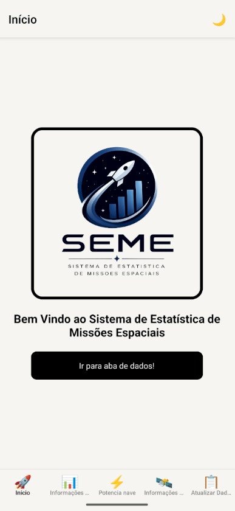
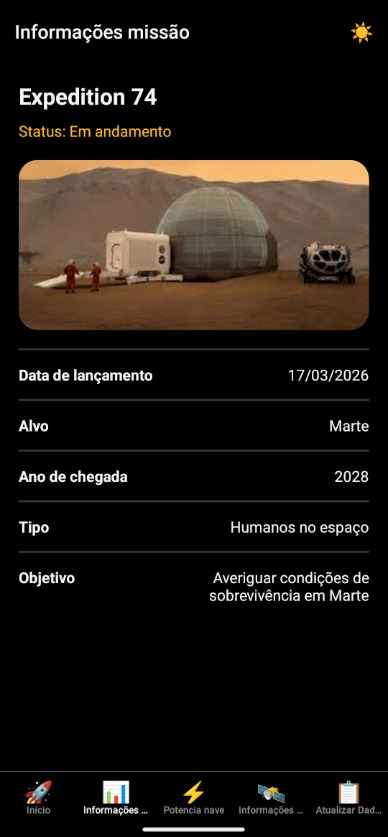
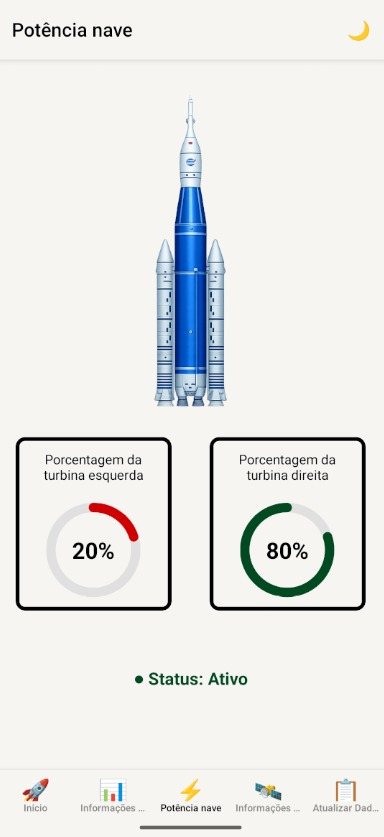
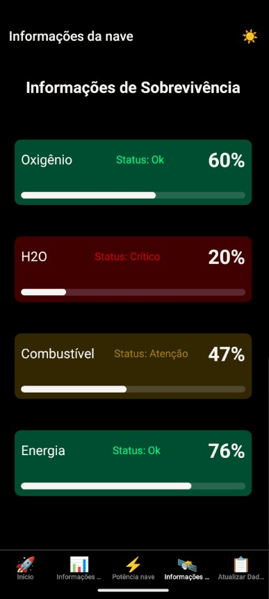
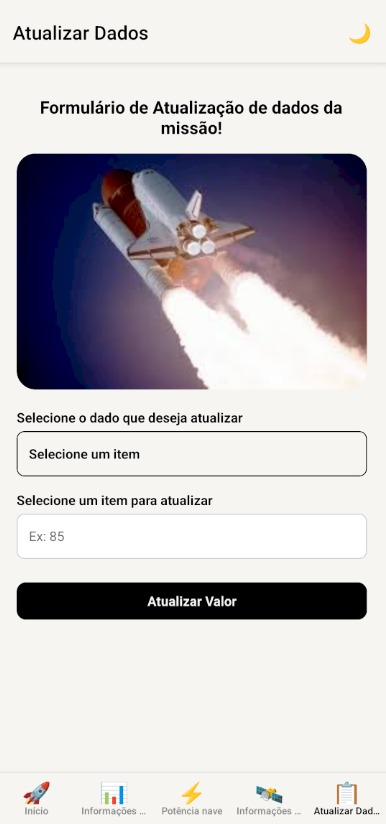

# SEME - Sistema de Estatística de Missões Espaciais

### Global Solution 2026.1 | Cross-Platform Application Development | FIAP


*Dica: Substitua esta imagem pelo link do banner temático criado pelo grupo ou gerado por IA.*

---

## 📋 Descrição

O **SEME (Sistema de Estatística de Missões Espaciais)** é um aplicativo mobile desenvolvido com React Native e Expo focado em auxiliar profissionais a atualizarem os valores de itens presentes em  missões espaciais, como H2O, O2, Combustível, entre outros. O intuito é facilitar a visualização dos dados por parte desses profissionais e ajudá-los a ter um maior controle dos dados presentes na missão.

---

## 👥 Equipe

* Fernando Caires Silva - RM: 563415
* Guilherme Martins Rezende - RM: 563500
* Raphael Mischiatti Souza - RM: 563567

---

## 📱 Telas do Aplicativo

### Home (Dashboard Principal)


Tela de início apresentando a logo do projeto e disponibilizando um botão para redirecionar o usuário para as informações gerais da missão.

### Informações gerais da missão


Informações básicas da missão contendo: data de saída, data esperada de chegada, objetivo, nome da missão e qual o tipo (humanos ou robôs).

### Dashboard turbina foguete


Tela mostrando a % de cada uma das turbinas que está sendo usada com um círculo para representar a % de forma mais visual.

### Dashboard de informações de sobrevivência


Dashboard indicando os níveis de condições necessárias para os seres humanos presentes na missão sobreviverem, como quantidade de O2, quantidade de H2O, combustível e energia na nave.

### Formulário


Formulário para realizar as atualizações dos componentes da missão. Nele, é possível alterar tanto a quantidade de itens de sobrevivência e a % da turbina, com valores disponíveis entre 1 e 100.


---

## ⚙️ Funcionalidades

- **Dashboards em Tempo Real (Simulado):** Exibição de estatísticas de telemetria, incluindo níveis de $O_2$ e potência de turbinas.
- **Sistema de Alertas Automáticos:** Geração de avisos visuais na interface com base em limiares críticos pré-definidos.
- **Persistência de Dados Local:** Armazenamento das configurações de alerta personalizados e preferências do usuário utilizando `AsyncStorage`.
- **Navegação Fluida:** Arquitetura de rotas limpa e intuitiva utilizando `Expo Router` (Tabs/Stack).
- **Gerenciamento de Estado Global:** Compartilhamento de dados de telemetria em tempo real entre múltiplas telas via `Context API`.
- **Formulários Validados:** Inputs controlados com tratamento de erros visuais para evitar inserção de parâmetros de missão inválidos.

---

## 🛠️ Tecnologias Utilizadas

* **React Native** (com Expo Workflow)
* **Expo Router** (Roteamento baseado em arquivos)
* **Context API** (Estado global da simulação)
* **AsyncStorage** (Persistência local de dados)

---

## 🚀 Como Executar o Projeto

### Pré-requisitos
Antes de começar, certifique-se de ter instalado em sua máquina:
* **Node.js** (versão LTS recomendada)
* **Expo Go** instalado no seu dispositivo móvel (disponível para Android e iOS)

### Instalação e Execução

1. **Clone o repositório:**
   ```bash
   git clone https://github.com/Rezenderzd/gs1-react-native
2. **Acesse a pasta do projeto:**
    ````bash
    cd gs1-react-native
3. **Instale as dependências:**
    ````bash
    npm install
4. **Inicie o projeto:**
    ````bash
    npx expo start
5. **Abrir o aplicativo:**
Escaneie o QR Code exibido no terminal utilizando o aplicativo Expo Go para rodar no dispositivo físico.

## 🎥 Vídeo de Demonstração

Clique no link abaixo para assistir ao vídeo de até 3 minutos demonstrando todas as telas e funcionalidades principais do app SEME:

▶️ [Clique aqui para assistir à demonstração da solução](https://youtu.be/PNL_HR7IILA)

## 📄 Licença

Este projeto foi desenvolvido para fins acadêmicos como parte da avaliação Global Solution 2026.1 na FIAP.